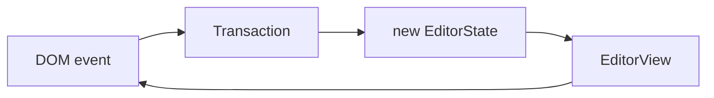

# Background

This directory contains code related to the [ProseMirror](https://prosemirror.net/)-based editor for [proofreading](https://ambuda.org/proofing/).

This will allow (and enforce) the text being edited to be a structured document. (Implemented internally as a [contenteditable](https://developer.mozilla.org/en-US/docs/Web/HTML/Global_attributes/contenteditable) div, where ProseMirror deals with all the cross-browser [complexity](https://developer.mozilla.org/en-US/docs/Web/Guide/HTML/Editable_content).)

# Code structure

*   `pm-editor.ts`: The top-level code that defines a schema and (for now) conversion from/to plain text.

# ProseMirror quick intro

Because ProseMirror is so flexible and modular (_"we are prioritizing modularity and customizability over simplicity […] more of a Lego set than a Matchbox car"_), it requires specifying in detail *exactly* what we want out of the editor.

The [documentation](https://prosemirror.net/docs/guide/) is good and can be read in an hour, but below is a quick 5-minute version to help look up the [reference](https://prosemirror.net/docs/ref/).

ProseMirror is built on a few concepts:

- A *schema* specifies what kind of nodes a document may contain.

- A [*Document*](https://prosemirror.net/docs/guide/#doc) is a data structure that holds the document being edited.

- The editor's *state* includes the document and things like the current selection.

- There are *Transform*s (in particular, *Transaction*s) that can be applied to a state to give a new state.

- The editor *view* displays the editor state in the browser DOM, and handles user events (editing actions).

So: `view.state.doc.schema`.

[Data flow](https://prosemirror.net/docs/guide/#view.data_flow):

> So the editor view displays a given editor state, and when something happens, it creates a transaction and broadcasts this. This transaction is then, typically, used to create a new state, which is given to the view using its `updateState` method.

More details are in [the guide](https://prosemirror.net/docs/guide/) and [reference](https://prosemirror.net/docs/ref/).
