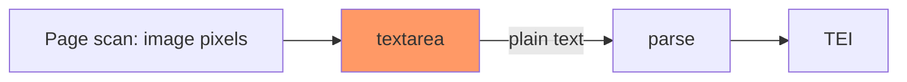
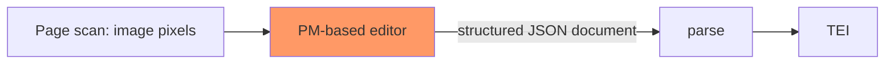

# Background

This directory contains code relateed to the [ProseMirror](https://prosemirror.net/)-based editor for [proofreading](https://ambuda.org/proofing/).

The idea is that while:

-   the current textarea-based requires users to mark up using various conventions, and results in plain text being sent to the backend to be parsed,

-   a random WYSIWYG editor would allow arbitrarily styled HTML (which we hardly need, and much of it would have to be stripped out),

a ProseMirror-based editor can provide a "best of both worlds" alternative, allowing (and enforcing) a structured document to be edited. (Implemented internally as a [contenteditable](https://developer.mozilla.org/en-US/docs/Web/HTML/Global_attributes/contenteditable) div, dealing with all the cross-browser [complexity](https://developer.mozilla.org/en-US/docs/Web/Guide/HTML/Editable_content).)

Something like this:

into

The cost is that because ProseMirror is so flexible and modular, it requires specifying in tedious detail *exactly* what we want out of the editor. It's more like a set of Lego blocks than anything readily usable.

# Code structure

*   `pm-editor.ts`: The top-level code to replace the textarea with the PM-based editor

    *   `schema.ts`: Specifying exactly what structure we'd like the "structured document" being edited to have.

    *   `plugins.ts`: Adding basic functionality to the editor.

        *   `menu.ts`: Menu buttons for toggling bold/italic etc (when the schema supports them).

        *   `keymap.ts`: Keyboard shortcuts. (By default, even keys like undo–redo aren't supported.)

