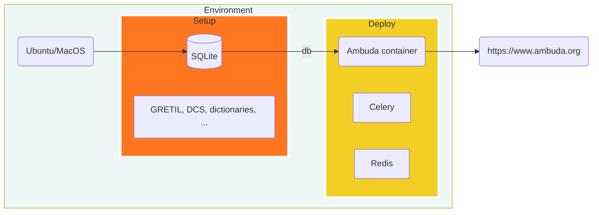
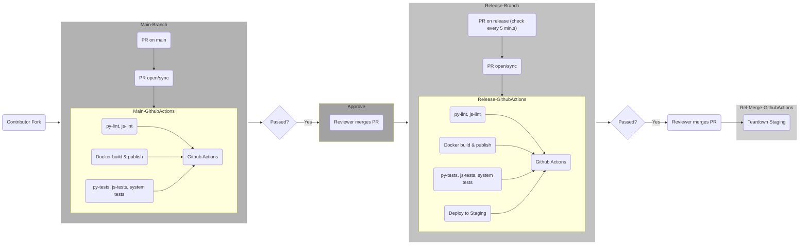

## How it works?

```mermaid
graph LR

    subgraph Environment
    os(Ubuntu/MacOS) 
    os --> db
    db -->|db| ambuda   
    
    subgraph Setup
    db[("SQLite")]
    texts[GRETIL, DCS, dictionaries, ...]
    end
    style Setup fill:#ff7621,stroke:#fff,stroke-width:4px

    
    subgraph Deploy
    ambuda(Ambuda container) & celerey[Celery] & redis[Redis]
    end 
    style Deploy fill:#f3cf26, stroke:#fff, stroke-width:4px
    end
    style Environment fill:#edf7f6

    ambuda --> browser(https://www.ambuda.org)
```

## What is the PR process?

```mermaid
flowchart LR
    contributor(Contributor Fork)    
    ghact(Github Actions)
    pre(py-lint, js-lint)
    build(Docker build & publish)
    post(py-tests, js-tests, system tests)
    subgraph Main-Branch
        code(PR on main)
        code-->open(PR open/sync)
        open-->Main-GithubActions
        
        subgraph Main-GithubActions
            pre-->ghact
            build-->ghact
            post-->ghact
        end
    end

    subgraph Approve
        approve(Reviewer merges PR)
    end

    rel-ghact(Github Actions)
    rel-pre(py-lint, js-lint)
    rel-build(Docker build & publish)
    rel-post(py-tests, js-tests, system tests)
    rel-staging(Deploy to Staging)
    subgraph Release-Branch
        rel-pr("PR on release (check every 5 min.s)")
        rel-pr-->rel-pr-open(PR open/sync)
        rel-pr-open-->Release-GithubActions
        subgraph Release-GithubActions
            rel-pre-->rel-ghact
            rel-build-->rel-ghact
            rel-post-->rel-ghact
            rel-staging-->rel-ghact
        end
    end
    
    subgraph Rel-Merge-GithubActions
        rel-staging-down(Teardown staging)
    end
    
    style Main-Branch fill:#b2b2b2, stroke:#fff, stroke-width:4px
    style Approve fill:#a2a2a2
    style Release-Branch fill:#c2c2c2, stroke:#fff, stroke-width:4px
    style Rel-Merge-GithubActions fill:#d1d1d1, stroke:#fff, stroke-width:4px
    contributor-->Main-Branch    
    Main-Branch-->check{Passed?}
    check-->|Yes|Approve    
    Approve-->Release-Branch
    Release-Branch-->rel-check{Passed?}
    rel-check-->|Yes|rel-merge(Reviewer merges PR)
    rel-merge-->rel-staging-down(Teardown Staging)
```
