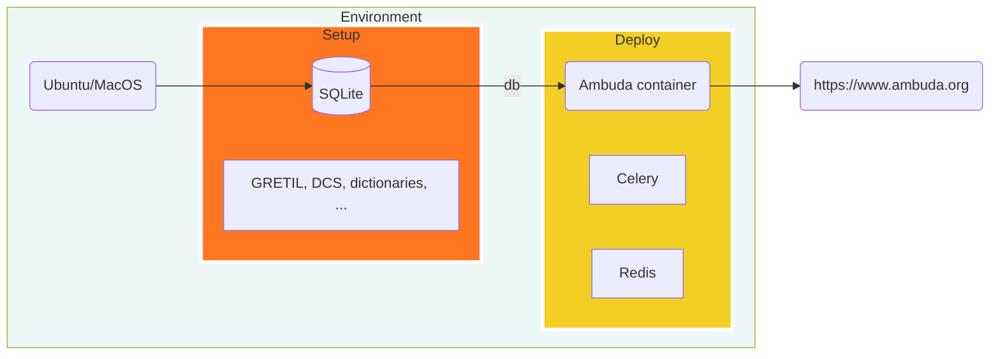
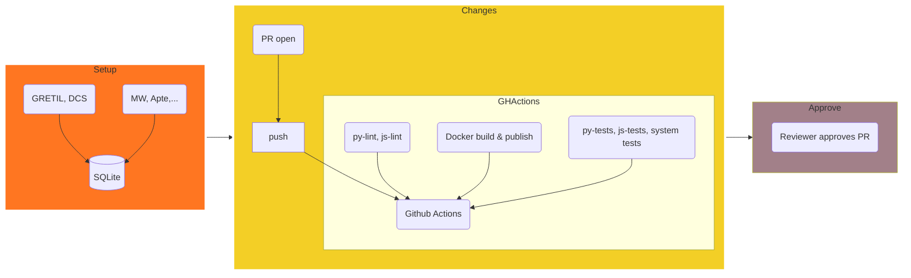

## How it works?

```mermaid
graph LR

    subgraph Environment
    os(Ubuntu/MacOS) 
    os --> db
    db -->|db| ambuda   
    
    subgraph Setup
    db[("SQLite")]
    texts[GRETIL, DCS, dictionaries, ...]
    end
    style Setup fill:#ff7621,stroke:#fff,stroke-width:4px

    
    subgraph Deploy
    ambuda(Ambuda container) & celerey[Celery] & redis[Redis]
    end 
    style Deploy fill:#f3cf26, stroke:#fff, stroke-width:4px
    end
    style Environment fill:#edf7f6

    ambuda --> browser(https://www.ambuda.org)
```

## What is the PR process?

```mermaid
flowchart LR
    subgraph Setup
        db[("SQLite")]
        texts(GRETIL, DCS)-->db
        dictionaries(MW, Apte,...)-->db
    end
    style Setup fill:#ff7621,stroke:#fff,stroke-width:4px
    
    ghact(Github Actions)
    pre(py-lint, js-lint)
    build(Docker build & publish)
    post(py-tests, js-tests, system tests)
    
    subgraph Changes
        code(PR open)
        code-->push
        push-->ghact
        
        subgraph GHActions
            pre-->ghact
            build-->ghact
            post-->ghact
        end
    end
    subgraph Approve
        approve(Reviewer approves PR)
    end
    Setup-->Changes
    Changes-->Approve    
    style Changes fill:#f3cf26, stroke:#fff, stroke-width:4px
    style Approve fill:#a28089
```
